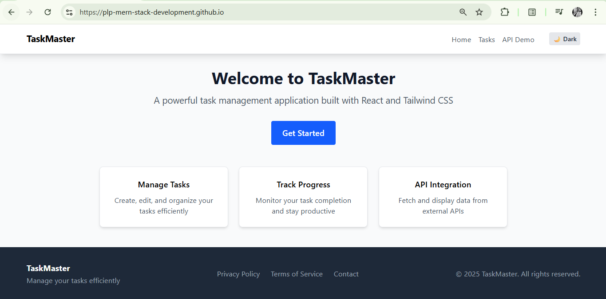
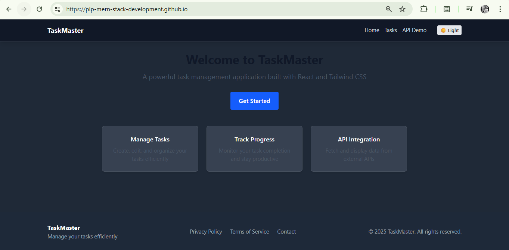
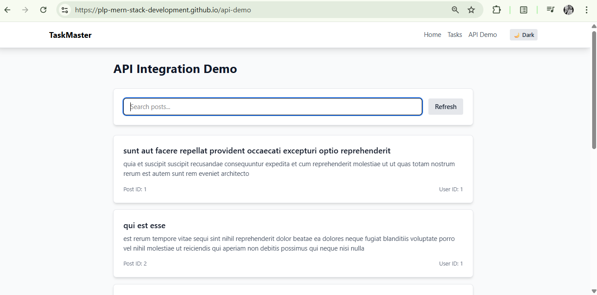
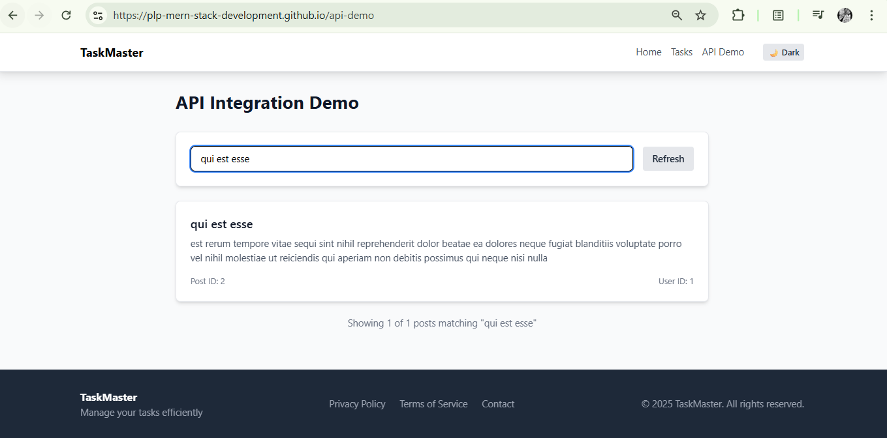

# React Task Manager

## Project Description

This is a modern React-based Task Manager application built with Vite and Tailwind CSS. It allows users to manage their tasks efficiently and features a theme switcher for toggling between light and dark modes. It shows my commitment to master MERN in my journey at PLP.

## Features

*   **Task Management:** Add, view, edit, and delete tasks.
*   **Theme Switching:** Seamlessly switch between light and dark themes for a personalized user experience.
*   **Responsive Design:** Optimized for various screen sizes.
*   **API Integration:** (Optional - if applicable, otherwise remove) Demonstrates integration with a placeholder API.
*   **Routing:** Utilizes React Router DOM for navigation between different sections (Home, Tasks, API Demo).

## Screenshots

_Screenshots of my application to showcase its features.

### Light Mode


### Dark Mode


### API page


### Search effect in API page



## Deployed Application

🚀 Live Demo: [https://plp-mern-stack-development.github.io/react-js-jsx-and-css-mastering-front-end-development-Tornado-techie/](https://plp-mern-stack-development.github.io/react-js-jsx-and-css-mastering-front-end-development-Tornado-techie/)

## Technologies Used

*   React.js
*   Vite.js
*   Tailwind CSS (v4)
*   React Router DOM

## Setup Instructions

Follow these steps to get your development environment set up and run the project locally:

### Prerequisites

Make sure you have the following installed:

*   Node.js (LTS version recommended)
*   npm (comes with Node.js) or Yarn

### Installation

1.  **Clone the repository:**

    ```bash
    git clone https://github.com/PLP-MERN-Stack-Development/react-js-jsx-and-css-mastering-front-end-development-Tornado-techie.git
    cd react-js-jsx-and-css-mastering-front-end-development-Tornado-techie
    ```

2.  **Install dependencies:**

    ```bash
    npm install
    # or
    yarn install
    ```

### Running the Development Server

To start the development server:

```bash
npm run dev
# or
yarn dev
```

This will usually open the application in your browser at `http://localhost:5173/` (or another port if 5173 is in use).

### Building for Production

To create a production-ready build:

```bash
npm run build
# or
yarn build
```

This will generate optimized static assets in the `dist` directory.

### Deployment to GitHub Pages

To deploy your application to GitHub Pages, you can use the `deploy` script:

```bash
npm run deploy
# or
yarn deploy
```

Ensure your `package.json` has the `homepage` field correctly configured for GitHub Pages, and `gh-pages` is installed as a dev dependency.


Salome Mundia